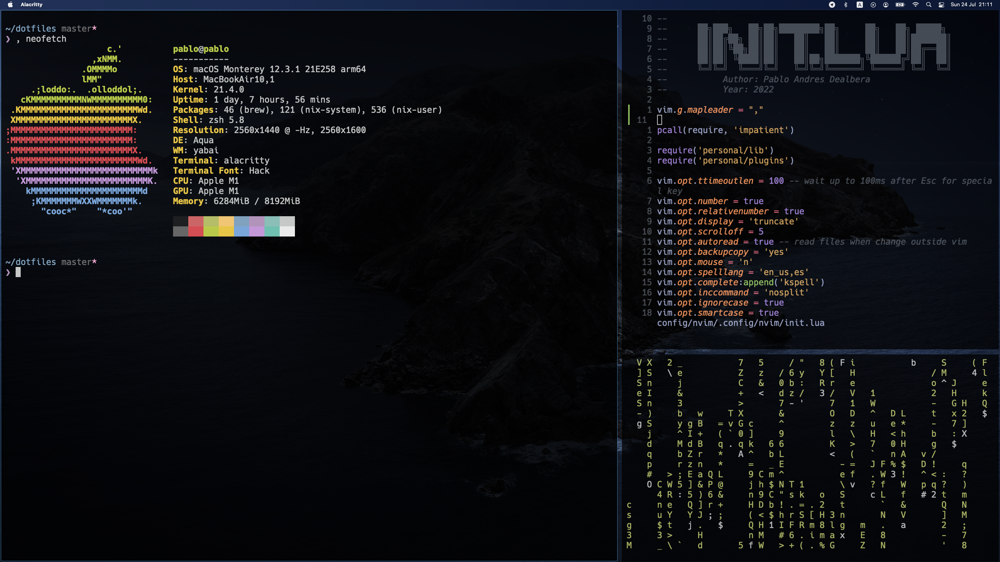
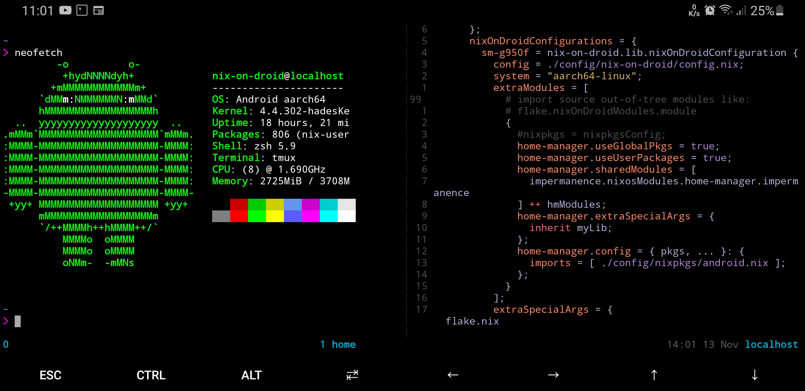

# Arch Linux + Nix config

## TODO: bootstrap Arch Linux install

## Bootstrap Home Manager
```
nix run --no-write-lock-file github:nix-community/home-manager/ -- --flake ".#$USER" switch
```

## Run this command
```
home-manager switch --flake .
```

# Nix Darwin config



## Run this command
```
darwin-rebuild switch --flake .
```

# Nix on Android config



## First install
```
nix --extra-experimental-features nix-command shell --extra-experimental-features flakes nixpkgs#git
ssh-keygen
git clone https://github.com/Pablo1107/dotfiles
```

## Run this command
```
nix-on-droid switch --flake ".#sm-g950f"
```
